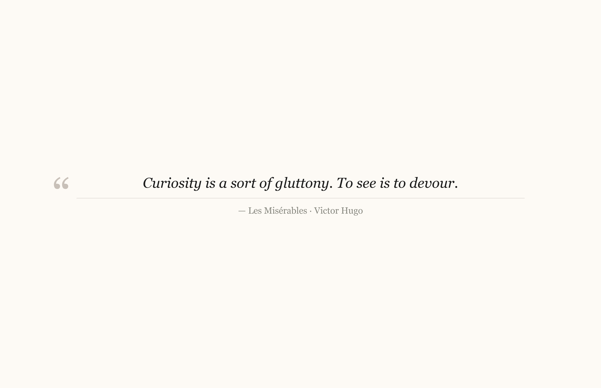

# kindle-wallpapers

You have a lot of good stuff highlighted on your Kindle. You never go back to read it.

This turns every highlight into a desktop wallpaper. macOS rotates through them. Good ideas show up on their own.



---

## install

```bash
pip install kindle-wallpapers
```

## run

1. Connect your Kindle to your Mac via USB
2. Wait for it to appear in Finder (shows up as "Kindle" under Locations)
3. Run:

```bash
kindle-wallpapers
```

That's it. First run generates a wallpaper for every highlight (>5 words). Subsequent runs only process new ones.

Wallpapers land in `~/Pictures/KindleWallpapers/`.

## set up rotation (macOS)

System Settings → Wallpaper → Add Folder → select `~/Pictures/KindleWallpapers`

Turn on shuffle. Set whatever interval you like.

---

**No Kindle connected?** The script falls back to the last synced clippings file, so it still works.

Data lives in `~/.kindle-wallpapers/` — highlights database and a local copy of your clippings.

## readwise (optional)

`My Clippings.txt` only captures highlights made on the physical device. If you've highlighted on the Kindle app (phone, tablet, Mac), those live on Amazon's servers and won't be in the file.

Readwise syncs all your highlights across every device. To connect it:

```bash
kindle-wallpapers setup
```

Paste your API token from [readwise.io/access_token](https://readwise.io/access_token) when prompted. The token is stored in macOS Keychain — not in any file.

From then on, every run pulls from both sources automatically.

---

## how it works

Kindles store every highlight you make in a plain text file called `My Clippings.txt` on the device. When you connect via USB, this file is accessible like any other file on a USB drive.

The script copies that file locally, then parses it — each entry has the book title, author, and the highlighted text. Highlights under 6 words (single words, short phrases) are filtered out.

Every highlight gets hashed and tracked in a local JSON file (`~/.kindle-wallpapers/highlights.json`). On subsequent runs, only highlights not already in that file get processed — so it's incremental and nothing gets regenerated unnecessarily.

For each new highlight, it generates a PNG image at your display's native resolution using Pillow — quote centered in Georgia Italic, book title and author as attribution below a thin rule, ghost quotation mark in the background. Warm off-white background, near-black text.

Those PNGs go into `~/Pictures/KindleWallpapers/`. macOS wallpaper rotation does the rest.

If Readwise is configured, the script also fetches highlights from there — books and authors are resolved via the Readwise books API and merged with the clippings highlights before generating.
